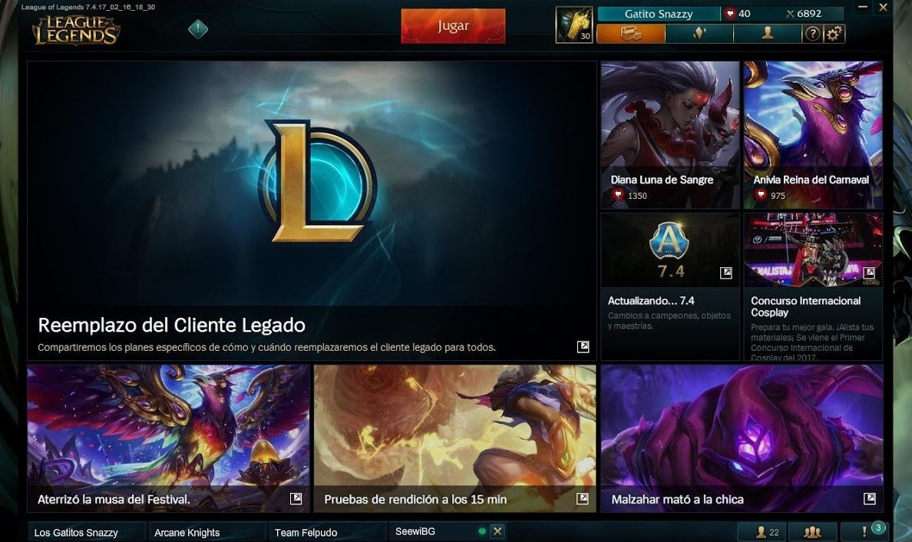
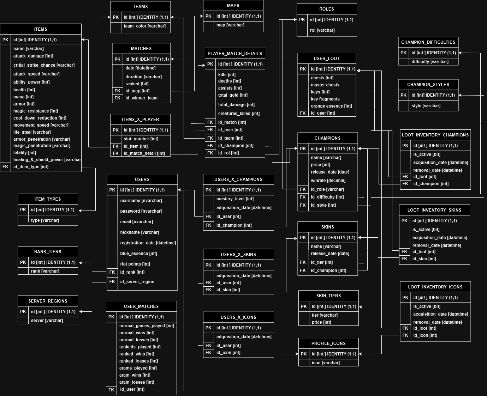

# 🎮 LOL Client - League of Legends Client Simulator

📄 [Versión en español](../../../README.md)



This project is a simulation of the internal structure and business logic behind the **League of Legends** client, focusing on managing users, servers, champions, inventory, matches, and more.

📄 [Versión en español](README.md)

## 🚀 Technologies used

- Java 17  
- Spring Boot  
- Maven  
- JPA / Hibernate  
- Lombok  
- MapStruct  
- Swagger / OpenAPI  
- In-memory database (H2)  
- IntelliJ IDEA project structure (`.idea`)

## 🖼️ Database diagram

The following diagram illustrates the system's entities and relationships:



## 🧠 Main features

This backend simulates how a League of Legends client manages data, organizing all information by **server**, and allowing operations on users, champions, skins, profile icons, matches, and more. Features are grouped into the following modules:

### 🌍 Servers
- Each server represents a region (e.g., LAS, NA, EUW).
- Everything on a server (users, inventory, matches, etc.) is **isolated** from other servers.
- It's the main filter used throughout the system.

### 👤 Users
- Search by:
  - ID
  - Registration date
  - League rank
  - Winrate (ARAM, normals, ranked)
  - Number of matches played
  - Rank tier + server
- Advanced filters supported
- Partial CRUD with validations (delete pending)

### 🛡️ Champions
- Search by:
  - Name (contains)
  - Difficulty
  - Role 1 / Role 2
  - Style 1 / Style 2
  - Release date
  - Price
  - Winrate
  - Owned / Not owned by user
- CRUD with validations (create, update, delete pending)
- Combined filters by role and style

### 🧥 Skins
- Search by:
  - ID, name, price
  - Associated champion
  - Skins the user **can buy**
  - Skins the user already has / doesn't have
- Full CRUD with validations

### 💠 Profile Icons
- Search by:
  - ID and name
  - Icons the user has / doesn't have (WIP)
- Full CRUD

### 🎒 Match Items
- Search by:
  - Type 1 / Type 2
  - Name (partial match)
  - ID
- Full CRUD with validations

### 🔁 User-resource relations

- **User x Champion**  
  - Search by ID, user, champion, or both  
  - Full CRUD with validations

- **User x Skin**  
  - Same as above, applied to skins  
  - Full CRUD with validations

- **User x Profile Icon**  
  - Same structure to manage unlocked icons  
  - Full CRUD with validations

### 🏆 Matches (planned)

A **match** module is planned for future development. It will simulate game sessions between users, with logic adapted to the match type.

#### Planned match types

- **Ranked**
  - Strict matchmaking by `rankTier`
  - Each player is assigned a **map role** (e.g., top, jungle, etc.)
  - Champion selection from user's inventory
  - Playstyle determines what items are assigned
  - Items must match the assigned style

- **Normal**
  - More flexible matchmaking
  - Same logic for role, champion, and style selection

- **ARAM**
  - Free matchmaking, no role requirement
  - Random champion selection from user's inventory
  - Item style logic still applies

#### Expected logic

- Matches are expected to be generated **automatically** per server
- In the future, users may be able to:
  - Create a match manually
  - Choose match type
  - Select a champion (except in ARAM)
  - Define item build style

This module has not been implemented yet, but it is part of the project roadmap to simulate how LoL handles gameplay sessions within its client.

---

With this architecture, the system aims to replicate how the real LoL client organizes information per player and per region, enabling rich filters and digital asset management (champions, skins, icons).

## 🗂️ Project structure

```
LOL_Client/
├── Back/            # Java Spring Boot backend
│   ├── src/         # Source code
│   ├── pom.xml      # Maven config
│   └── dbdiagram/   # Database diagram
└── .idea/           # IntelliJ project config
```

_Last update: June 2025_