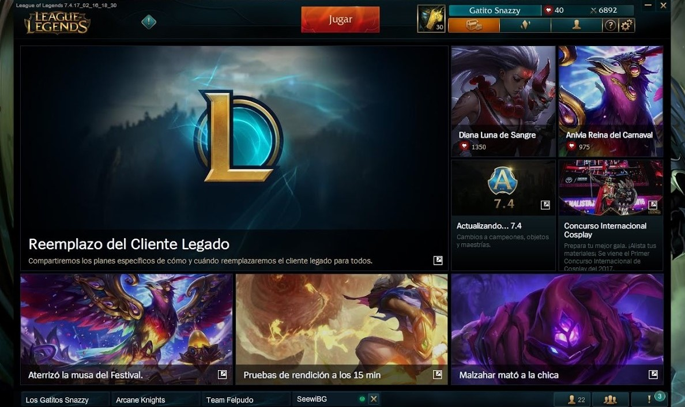
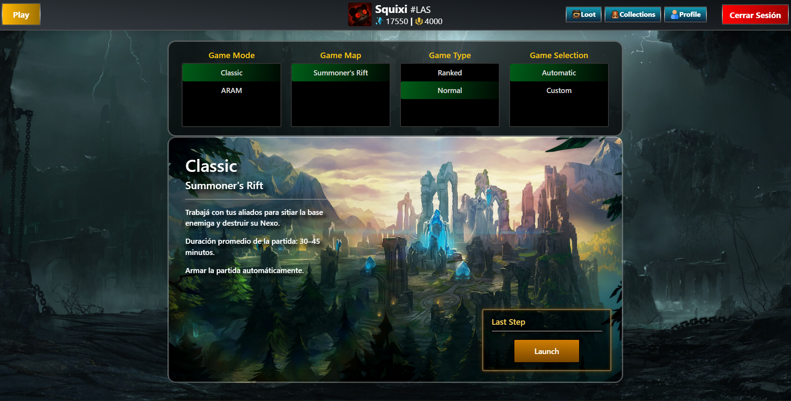
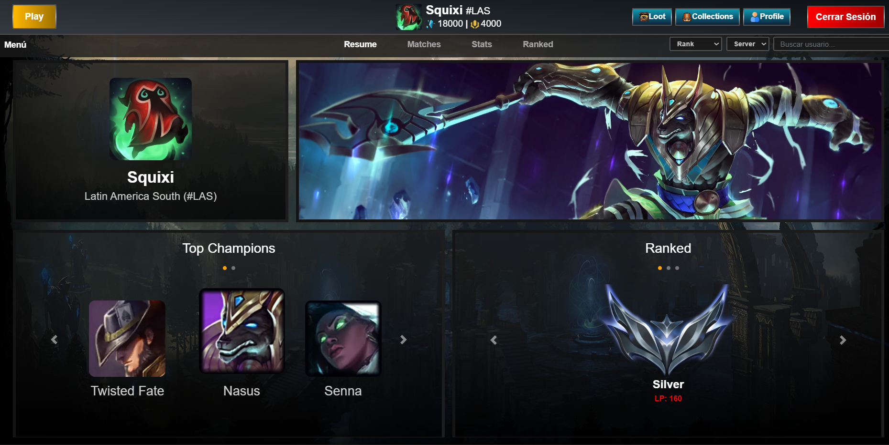
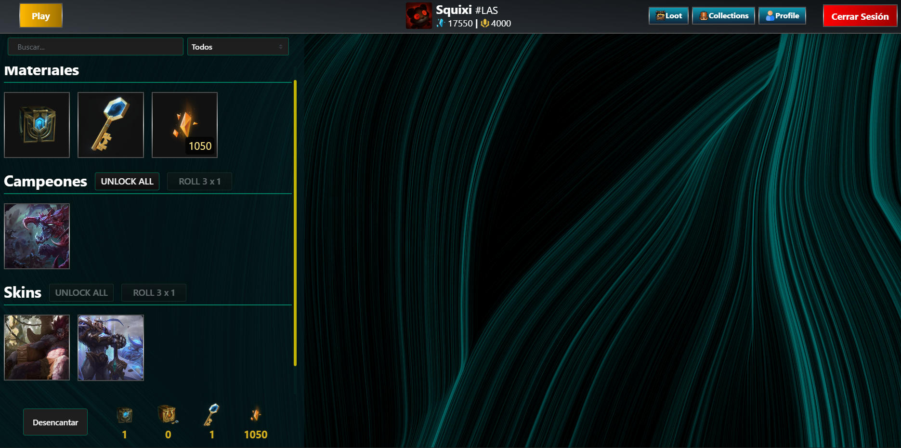
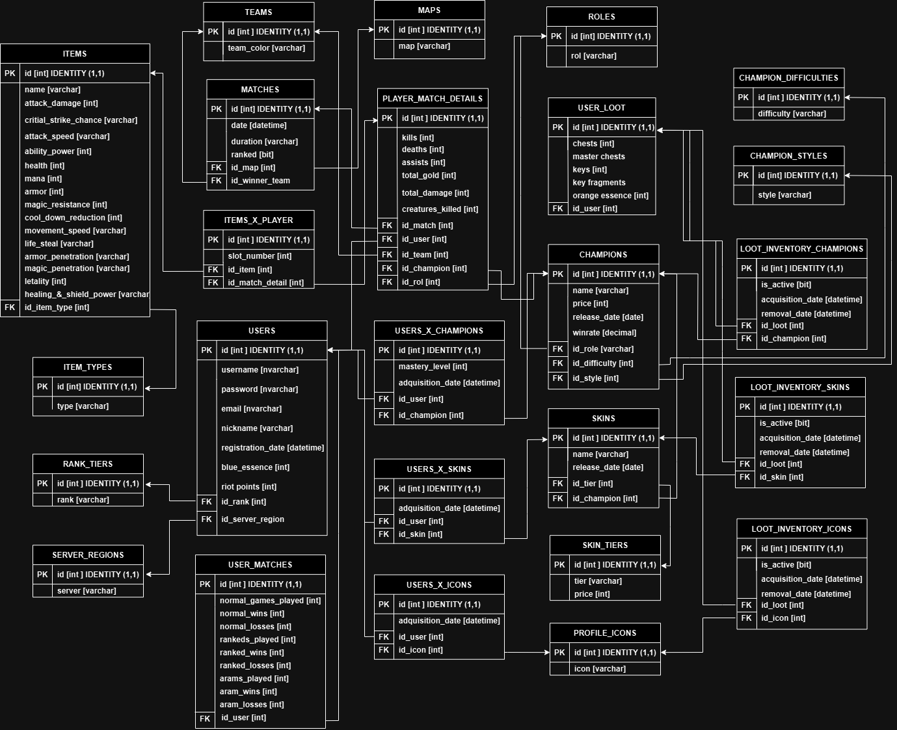

# 🎮 LOL Client - Simulador



---

## 📑 Índice

1. [🚀 Demo](#-demo)
2. [🚀 Tecnologías utilizadas](#-tecnologías-utilizadas)

3. [🎮 Simulación de partidas](#-simulación-de-partidas)
   - [⚙️ Emparejamiento](#️-emparejamiento)
   - [🎯 Modos de juego](#-modos-de-juego)
   - [🎲 Generación automática](#-generación-automática)
   - [🧠 Itemización y estilos](#-itemización-y-estilos)
   - [📊 Distribución de estadísticas](#-distribución-de-estadísticas)

4. [👤 Gestión de usuarios](#-gestión-de-usuarios)

5. [💰 Sistema de progresión y recompensas](#-sistema-de-progresión-y-recompensas)
   - [🏆 Progresión competitiva](#-progresión-competitiva)
   - [🎁 Recompensas post-partida](#-recompensas-post-partida)
   - [💎 Economía e inventario](#-economía-e-inventario)

6. [🖼️ Arquitectura y modelo de datos](#️-arquitectura-y-modelo-de-datos)
   - [🌍 Servidores](#-servidores)
   - [👤 Usuarios](#-usuarios)
   - [🛡️ Campeones](#️-campeones)
   - [🧥 Skins](#-skins)
   - [💠 Íconos de perfil](#-íconos-de-perfil)
   - [🎒 Objetos de la partida](#-objetos-de-la-partida)
   - [🔁 Relaciones de usuario con recursos](#-relaciones-de-usuario-con-recursos)
   - [🏆 Sistema de partidas](#-sistema-de-partidas)

7. [🗂️ Estructura del proyecto](#️-estructura-del-proyecto)

---

📄 [English version](README.en.md)

Este proyecto es una simulación del funcionamiento interno de un cliente de League of Legends, centrado en la lógica de negocio que gestiona usuarios, servidores, campeones, inventarios y partidas.

Además, cuenta con una aplicación frontend que integra y expone toda esta lógica a través de una interfaz interactiva, permitiendo a los usuarios registrarse, iniciar sesión, generar partidas, gestionar su inventario y visualizar estadísticas, conformando un entorno funcional completo donde pueden ser utilizadas y exploradas en tiempo real.

---

## 🚀 Demo

### 🌐 [LOL Client Frontend](https://lol-client-front.onrender.com/)

### ⚙️[LOL Client Backend](https://lol-client-back.onrender.com/) (Endpoints)

---

## 🚀 Tecnologías utilizadas

- Java 17
- Spring Boot
- Maven
- JPA / Hibernate
- Lombok
- MapStruct
- Swagger / OpenAPI
- Docker
- JavaScript
- HTML5
- CSS3
- Base de datos en memoria (H2)
- IntelliJ IDEA (estructura `.idea`)

---

## 🎮 Simulación de partidas



El sistema permite generar partidas automáticamente a partir de los usuarios disponibles en un servidor, aplicando reglas de emparejamiento, selección y distribución de estadísticas según el modo de juego.

### ⚙️ Emparejamiento

El proceso de creación de partidas sigue una lógica secuencial:

- Se buscan usuarios dentro del mismo servidor
- En partidas **Ranked**, se filtran jugadores con un rango igual o cercano
- En partidas **Normal**, no se aplica restricción por rango
- Se consideran únicamente usuarios con al menos un campeón disponible
- Los jugadores son asignados a roles en función de las posiciones requeridas

El sistema contempla la posibilidad de que el usuario principal preseleccione rol y/o campeón, mientras que el resto de los jugadores se asigna automáticamente.

---

### 🎯 Modos de juego

#### Ranked

- Emparejamiento basado en rango
- Selección de rol
- Selección de campeón desde el inventario
- Selección de skin asociada al campeón

#### Normal

- Emparejamiento sin restricción de rango
- Selección de rol
- Selección de campeón desde el inventario
- Selección de skin asociada

#### ARAM

- Sin asignación de roles
- Selección de campeón entre 3 opciones aleatorias del inventario
- Selección de skin asociada al campeón elegido

---

### 🎲 Generación automática

Todos los modos de juego permiten la creación automática de partidas, donde el sistema selecciona:

- Campeones disponibles del inventario del usuario
- Skins asociadas
- Roles (cuando aplica)

---

### 🧠 Itemización y estilos

Cada campeón posee uno o más estilos de juego. En base a esto:

- La itemización se genera de forma automática
- Se prioriza el estilo principal del campeón en caso de múltiples opciones
- Los ítems asignados son coherentes con el estilo definido

### 📊 Distribución de estadísticas

Las estadísticas de cada jugador se generan en función del rol asignado dentro de la partida, asegurando coherencia en el rendimiento simulado de cada posición.

---

## 👤 Gestión de usuarios



Los usuarios constituyen el núcleo del sistema, ya que sobre ellos se construyen y conectan todas las funcionalidades, concentrando la información necesaria para participar y progresar dentro del entorno de juego.

A partir de esta base, se estructuran los sistemas que definen su evolución dentro del juego:

- 💰 Recursos: los usuarios disponen de monedas como Blue Essence y Riot Points, utilizadas para la adquisición de contenido
- 🏆 Sistema competitivo: cada usuario posee un rango y una progresión en LP (League Points), que refleja su desempeño en partidas
- 🎒 Estado persistente: inventario, progreso e historial de partidas se actualizan dinámicamente en función de la actividad

Además, la sección de perfil permite visualizar en detalle el historial y estadísticas de las partidas del usuario, consultar rangos competitivos y realizar búsquedas de otros usuarios mediante filtros avanzados y combinados.

Estas características convierten al usuario en una entidad activa dentro del ciclo de juego, conectando la simulación de partidas con la progresión y la personalización.

---

## 💰 Sistema de progresión y recompensas



El sistema incorpora mecánicas de progresión competitiva y recompensas inspiradas en la experiencia de juego de League of Legends, conectando directamente el rendimiento del usuario con la expansión de su inventario y sus posibilidades dentro de las partidas.

### 🏆 Progresión competitiva

Las partidas Ranked cuentan con un sistema de rangos y LP (League Points), donde los usuarios progresan linealmente a través de distintos escalones competitivos.

El rango del jugador actúa como criterio principal para el emparejamiento en partidas clasificatorias, buscando generar enfrentamientos equilibrados entre usuarios de nivel similar.

---

### 🎁 Recompensas post-partida

Las recompensas se obtienen desde la sección de Loot mediante cofres desbloqueables tras las partidas:

- En partidas Normal y ARAM, las recompensas se otorgan únicamente al ganar
- En Ranked, los usuarios reciben recompensas tanto al perder como al ganar, aunque estas últimas son mayores

Los cofres pueden contener:

- Campeones
- Skins
- Íconos de perfil

---

### 💎 Economía e inventario

El sistema utiliza distintos tipos de recursos para desbloquear contenido:

- Blue Essence: utilizada para obtener campeones e íconos
- Orange Essence: utilizada para desbloquear skins

La expansión del inventario impacta directamente en la diversidad de las partidas, ya que aumenta la cantidad de campeones disponibles para selección y simulación.

Además, cada campeón posee estadísticas dinámicas y winrates variables, utilizadas como parte de la lógica que determina las probabilidades de victoria dentro de las partidas simuladas.

---

## 🖼️ Arquitectura y modelo de datos

Este backend simula el manejo de datos de un cliente de League of Legends, organizando la información por servidores y permitiendo operar sobre entidades como usuarios, campeones, skins, íconos de perfil, partidas, entre otras. Las funcionalidades se dividen en módulos principales:

El siguiente diagrama ilustra las entidades y relaciones del sistema:



### 🌍 Servidores

- Cada servidor representa una región (por ejemplo, LAS, NA, EUW).
- Todo lo que pertenece a un servidor (usuarios, partidas, inventario, etc.) **es exclusivo de ese entorno**. No hay cruce de información entre servidores.
- Filtro base para la mayoría de las consultas.

---

### 👤 Usuarios

- Consultas por:
  - ID
  - Fecha de registro
  - Rango de liga
  - Winrate (ARAM, normales, ranked)
  - Cantidad de partidas jugadas
  - Rank tier + servidor
- Filtros combinados avanzados
- CRUD parcial con verificaciones (falta delete)

---

### 🛡️ Campeones

- Consultas por:
  - Nombre (contiene)
  - Dificultad
  - Rol 1 / Rol 2
  - Estilo 1 / Estilo 2
  - Fecha de salida
  - Precio
  - Winrate
  - En posesión y no posesión
- CRUD con verificaciones (crear, editar, falta delete)
- Filtros cruzados por rol y estilo

---

### 🧥 Skins

- Consultas por:
  - ID, nombre, precio
  - Campeón asociado
  - Las skins que puede comprar un usuario
  - Las que ya tiene un usuario y las que no
- CRUD completo con verificaciones

---

### 💠 Íconos de perfil

- Consultas por:
  - ID y nombre
  - Los íconos que tiene o no tiene un usuario (en progreso)
- CRUD completo

---

### 🎒 Objetos de la partida

- Consultas por:
  - Tipo 1 / Tipo 2
  - Nombre (incluyendo coincidencias parciales)
  - ID
- CRUD completo con verificaciones

---

### 🔁 Relaciones de usuario con recursos

- **Usuario x Campeón**
  - Consulta por ID, usuario, campeón, o combinación.
  - CRUD completo con verificaciones.

- **Usuario x Skin**
  - Igual que el anterior, adaptado a skins.
  - CRUD completo con verificaciones.

- **Usuario x Ícono de perfil**
  - Igual estructura para gestionar íconos desbloqueados por usuario.
  - CRUD completo con verificaciones.

---

### 🏆 Sistema de partidas

El backend implementa la lógica central de simulación de partidas, incluyendo emparejamiento de usuarios, asignación de roles, selección de campeones e itemización automática según estilos de juego.

La generación de partidas se encuentra segmentada por modos (Ranked, Normal y ARAM), cada uno con reglas específicas de emparejamiento, selección y distribución de estadísticas.

Toda esta lógica se integra directamente con los sistemas de usuarios, inventario, progresión y recompensas del proyecto.

---

Con esta arquitectura, el sistema emula con precisión cómo el cliente de LoL organiza y presenta la información para cada jugador en su región, facilitando filtrados complejos y administración de contenido digital asociado (skins, campeones, íconos).

## 🗂️ Estructura del proyecto

```plaintext
LOL_Client/
├── Back/                         # Backend Spring Boot
│   ├── src/                      # Código fuente principal
│   ├── pom.xml                   # Configuración Maven
│   ├── dbdiagram/                # Diagramas y modelo de datos
│   └── docs/                     # Recursos y documentación del backend
│
├── Front/                        # Frontend de la aplicación
│   ├── css/                      # Estilos de la interfaz
│   ├── javascript/               # Lógica e interacción del frontend
│   └── pages/                    # Secciones y vistas de la aplicación
│
├── docs/
│   └── images/                   # Imágenes utilizadas en el README
│
├── README.md                     # Documentación principal
├── README.en.md                  # English version
└── .idea/                        # Configuración de IntelliJ IDEA