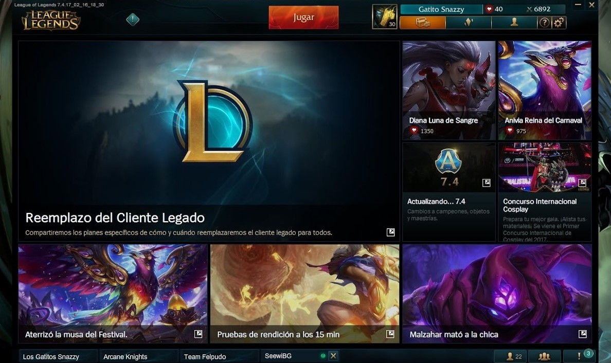
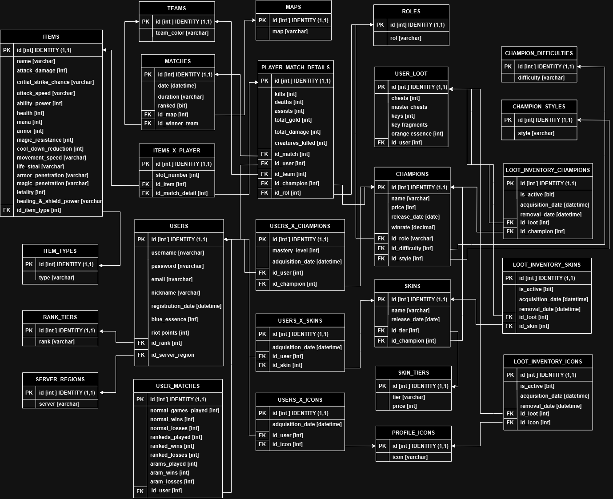

# 🎮 LOL Client - Simulador del Cliente de League of Legends

📄 [English version](Back/docs/README.en.md)

Este proyecto es una simulación del funcionamiento interno del cliente de **League of Legends**, enfocado en la lógica de negocio que gestiona usuarios, servidores, campeones, inventarios, partidas y más.

## 🚀 Tecnologías utilizadas

- Java 17
- Spring Boot
- Maven
- JPA / Hibernate
- Lombok
- MapStruct
- Swagger / OpenAPI
- Base de datos en memoria (H2)
- IntelliJ IDEA (estructura `.idea`)

## 🖼️ Diagrama de la base de datos

El siguiente diagrama ilustra las entidades y relaciones del sistema:

## 🧠 Funcionalidades principales

Este backend simula el manejo de datos de un cliente de League of Legends, organizando la información por servidores y permitiendo operar sobre entidades como usuarios, campeones, skins, íconos de perfil, partidas, entre otras. Las funcionalidades se dividen en módulos principales:

### 🌍 Servidores
- Cada servidor representa una región (por ejemplo, LAS, NA, EUW).
- Todo lo que pertenece a un servidor (usuarios, partidas, inventario, etc.) **es exclusivo de ese entorno**. No hay cruce de información entre servidores.
- Filtro base para la mayoría de las consultas.

### 👤 Usuarios
- Consultas por:
  - ID
  - Fecha de registro
  - Rango de liga
  - Winrate (ARAM, normales, ranked)
  - Cantidad de partidas jugadas
  - Rank tier + servidor
- Filtros combinados avanzados
- CRUD parcial con verificaciones (falta delete)

### 🛡️ Campeones
- Consultas por:
  - Nombre (contiene)
  - Dificultad
  - Rol 1 / Rol 2
  - Estilo 1 / Estilo 2
  - Fecha de salida
  - Precio
  - Winrate
  - En posesión y no posesión
- CRUD con verificaciones (crear, editar, falta delete)
- Filtros cruzados por rol y estilo

### 🧥 Skins
- Consultas por:
  - ID, nombre, precio
  - Campeón asociado
  - Las skins que puede comprar un usuario
  - Las que ya tiene un usuario y las que no
- CRUD completo con verificaciones

### 💠 Íconos de perfil
- Consultas por:
  - ID y nombre
  - Los íconos que tiene o no tiene un usuario (en progreso)
- CRUD completo

### 🎒 Objetos de la partida
- Consultas por:
  - Tipo 1 / Tipo 2
  - Nombre (incluyendo coincidencias parciales)
  - ID
- CRUD completo con verificaciones

### 🔁 Relaciones de usuario con recursos

- **Usuario x Campeón**  
  - Consulta por ID, usuario, campeón, o combinación.
  - CRUD completo con verificaciones.

- **Usuario x Skin**  
  - Igual que el anterior, adaptado a skins.  
  - CRUD completo con verificaciones.

- **Usuario x Ícono de perfil**  
  - Igual estructura para gestionar íconos desbloqueados por usuario.  
  - CRUD completo con verificaciones.

### 🏆 Partidas (en desarrollo)

El sistema contempla, a futuro, un módulo de **partidas** que permitirá simular enfrentamientos entre usuarios. La lógica estará basada en el tipo de partida, con reglas específicas para cada modalidad.

#### Tipos de partida previstos

- **Ranked**
  - El emparejamiento será estricto, agrupando usuarios con un `rankTier` similar.
  - Cada jugador recibirá un **rol específico del mapa** (por ejemplo: top, jungle, mid, etc.).
  - Se seleccionará un campeón desde su inventario personal.
  - Se definirá un **estilo de juego**, que determinará qué ítems se le asignarán.
  - Los ítems asignados deberán coincidir con el estilo definido.

- **Normal**
  - Emparejamiento más flexible que en ranked.
  - También se asignarán roles, campeones del inventario y un estilo que determinará los ítems.

- **ARAM**
  - Emparejamiento libre, sin necesidad de roles.
  - La selección de campeón será **aleatoria**, pero limitada al inventario del jugador.
  - Se mantendrá la lógica de asignación de estilo e ítems correspondientes.

#### Lógica general esperada

- Se prevé que las partidas puedan generarse **automáticamente** por servidor, respetando estas reglas.
- En versiones futuras, se incluirá la posibilidad de que el usuario:
  - Cree manualmente una partida
  - Elija el tipo de partida
  - Seleccione el campeón a utilizar (excepto en ARAM)
  - Determine el tipo de ítems que usará según su estilo

Este módulo aún no ha sido implementado, pero forma parte de los objetivos de desarrollo del proyecto, orientado a simular con fidelidad la lógica de juego de un cliente de League of Legends.

---

Con esta arquitectura, el sistema emula con precisión cómo el cliente de LoL organiza y presenta la información para cada jugador en su región, facilitando filtrados complejos y administración de contenido digital asociado (skins, campeones, íconos).

## 🗂️ Estructura del proyecto

LOL_Client/
├── Back/ # Backend Java Spring Boot
│ ├── src/ # Código fuente
│ ├── pom.xml # Configuración Maven
│ └── dbdiagram/ # Diagrama de base de datos
└── .idea/ # Archivos de configuración de IntelliJ